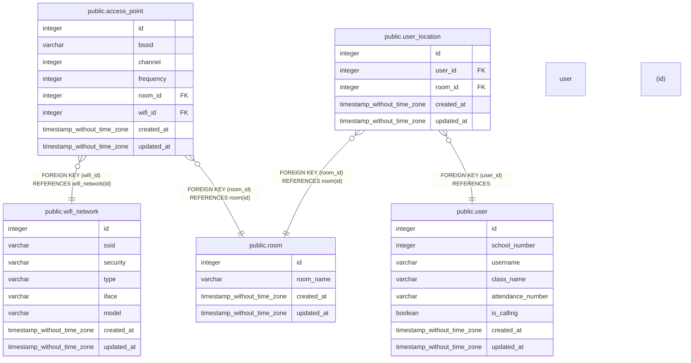

# database

## Tables

| Name | Columns | Comment | Type |
| ---- | ------- | ------- | ---- |
| [public.wifi_network](public.wifi_network.md) | 8 |  | BASE TABLE |
| [public.access_point](public.access_point.md) | 8 |  | BASE TABLE |
| [public.room](public.room.md) | 4 |  | BASE TABLE |
| [public.user_location](public.user_location.md) | 5 |  | BASE TABLE |
| [public.user](public.user.md) | 8 |  | BASE TABLE |

## Relations

---

> Generated by [tbls](https://github.com/k1LoW/tbls)
