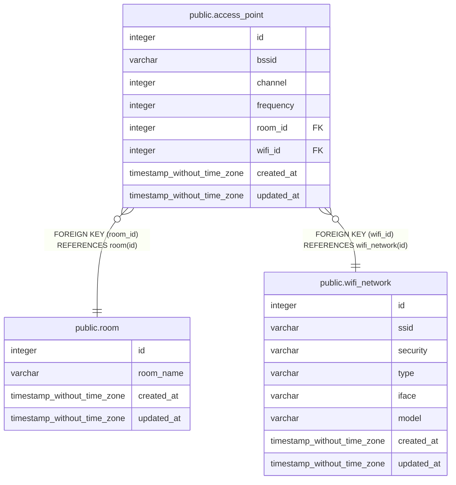

# public.access_point

## Description

## Columns

| Name | Type | Default | Nullable | Children | Parents | Comment |
| ---- | ---- | ------- | -------- | -------- | ------- | ------- |
| id | integer | nextval('access_point_id_seq'::regclass) | false |  |  |  |
| bssid | varchar |  | false |  |  |  |
| channel | integer |  | false |  |  |  |
| frequency | integer |  | false |  |  |  |
| room_id | integer |  | false |  | [public.room](public.room.md) |  |
| wifi_id | integer |  | false |  | [public.wifi_network](public.wifi_network.md) |  |
| created_at | timestamp without time zone | now() | false |  |  |  |
| updated_at | timestamp without time zone | now() | false |  |  |  |

## Constraints

| Name | Type | Definition |
| ---- | ---- | ---------- |
| FK_71443ce25d58c6dd7a330571ffc | FOREIGN KEY | FOREIGN KEY (wifi_id) REFERENCES wifi_network(id) |
| PK_5cedc7e014be621ec9b6439c141 | PRIMARY KEY | PRIMARY KEY (id) |
| FK_636b4f03e7de88ecdaff4e3259c | FOREIGN KEY | FOREIGN KEY (room_id) REFERENCES room(id) |

## Indexes

| Name | Definition |
| ---- | ---------- |
| PK_5cedc7e014be621ec9b6439c141 | CREATE UNIQUE INDEX "PK_5cedc7e014be621ec9b6439c141" ON public.access_point USING btree (id) |

## Relations

---

> Generated by [tbls](https://github.com/k1LoW/tbls)
