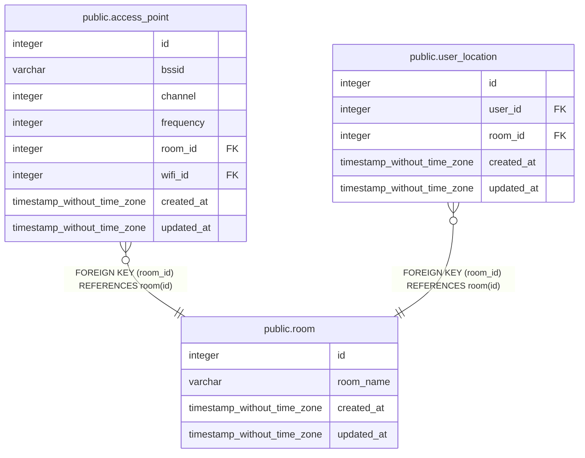

# public.room

## Description

## Columns

| Name | Type | Default | Nullable | Children | Parents | Comment |
| ---- | ---- | ------- | -------- | -------- | ------- | ------- |
| id | integer | nextval('room_id_seq'::regclass) | false | [public.access_point](public.access_point.md) [public.user_location](public.user_location.md) |  |  |
| room_name | varchar |  | false |  |  |  |
| created_at | timestamp without time zone | now() | false |  |  |  |
| updated_at | timestamp without time zone | now() | false |  |  |  |

## Constraints

| Name | Type | Definition |
| ---- | ---- | ---------- |
| PK_c6d46db005d623e691b2fbcba23 | PRIMARY KEY | PRIMARY KEY (id) |

## Indexes

| Name | Definition |
| ---- | ---------- |
| PK_c6d46db005d623e691b2fbcba23 | CREATE UNIQUE INDEX "PK_c6d46db005d623e691b2fbcba23" ON public.room USING btree (id) |

## Relations

---

> Generated by [tbls](https://github.com/k1LoW/tbls)
