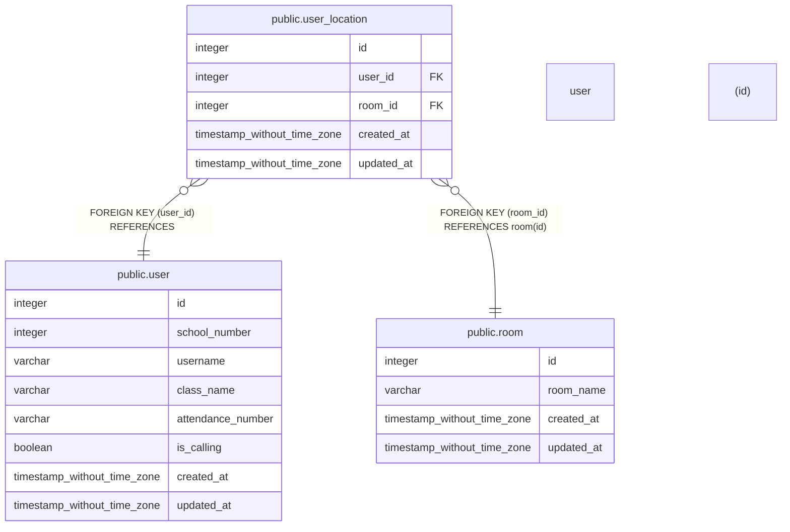

# public.user_location

## Description

## Columns

| Name | Type | Default | Nullable | Children | Parents | Comment |
| ---- | ---- | ------- | -------- | -------- | ------- | ------- |
| id | integer | nextval('user_location_id_seq'::regclass) | false |  |  |  |
| user_id | integer |  | false |  | [public.user](public.user.md) |  |
| room_id | integer |  | false |  | [public.room](public.room.md) |  |
| created_at | timestamp without time zone | now() | false |  |  |  |
| updated_at | timestamp without time zone | now() | false |  |  |  |

## Constraints

| Name | Type | Definition |
| ---- | ---- | ---------- |
| FK_c9d6e7e67066d32cea711910b19 | FOREIGN KEY | FOREIGN KEY (room_id) REFERENCES room(id) |
| PK_37bfb01591406f0fefaed6799a0 | PRIMARY KEY | PRIMARY KEY (id) |
| FK_84634a7525e249f57586d1fc421 | FOREIGN KEY | FOREIGN KEY (user_id) REFERENCES "user"(id) |

## Indexes

| Name | Definition |
| ---- | ---------- |
| PK_37bfb01591406f0fefaed6799a0 | CREATE UNIQUE INDEX "PK_37bfb01591406f0fefaed6799a0" ON public.user_location USING btree (id) |

## Relations

---

> Generated by [tbls](https://github.com/k1LoW/tbls)
